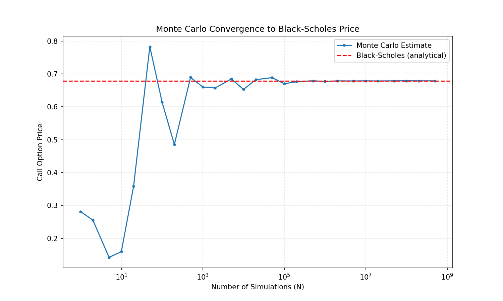

## Monte-Carlo Options Pricer
**Summary**: A study on Monte-Carlo methods and its optimisations through the lens of the Black-Scholes model.

### Motivation
The Black-Scholes-Merton equation gives an exact, instant analytical price for a European call option, but breaks down for path-dependent or American-style options where no closed form exists. Monte Carlo simulation works in either case, but at the cost of compute time and approximation error. This project implements both methods - empirically demonstrating that Monte Carlo converges to the Black-Scholes price as epochs increase, and parallelises the simulation via a threadpool to measure the resulting speedup.

### What's included
- ``simulation.cpp`` - implements Black-Scholes, naive Monte Carlo, and the thread-pool parallelised Monte Carlo, along with timing and convergence data generation. 
    - Outputs the numerical outputs of the 3 aforementioned methods comparing their compute times as well as their errors.
- ``visualise.py`` - reads the output csv generated by simulation.cpp and produces a convergence plot.

### Requirements
- The g++ compiler for C++ 
- Pandas and matplotlib libraries for Python

### Build and run
Run the C++ code first as follows:
```bash
g++ -O3 -o simulation.out simulation.cpp
./simulation.out
```
To retrieve a convergence plot, you may run:
```bash
python visualise.py
# or
python3 visualise.py
```
[If the BSM equation inputs are changed, please change the BSM value in ``visualise.py`` accordingly as it is hard-coded]

### Results

**Convergence**

Monte Carlo converges to the Black-Scholes price as the number of simulated epochs increases, settling within a fraction of a percent by N = 10⁴-10⁵:



**Performance**

Parallelising the simulation across a thread pool yields a ~2.6x speedup on a 4-core machine, by splitting the workload into independent per-thread chunks rather than using a shared job queue.

*Sample results:*

| Method | Time (100M epochs) | Error vs Black-Scholes |
|---|---|---|
| Black-Scholes (analytical) | <1ms | — |
| Monte Carlo (single-threaded) | ~6300ms | ~3.8e-05 |
| Monte Carlo (thread pool) | ~2400ms | ~9.7e-05 |

### Notes
- Random number generation uses a per-thread `std::mt19937` instance to avoid shared-state race conditions across threads.
- Workload is split statically per thread (rather than via a job queue) since the work is uniform in cost - Every Monte Carlo trial is independent, thus no synchronisation is needed during computation, only when combining final results. The lack of a job queue removes the need for synchronisation, removing unnecessary overhead.

